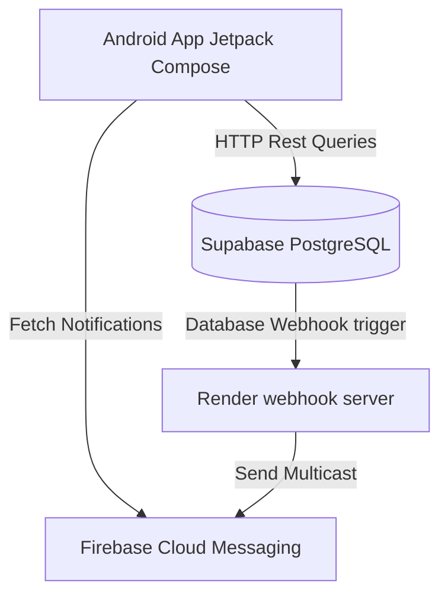

# Dentist Clinic Booking - Master Setup & Deployment Guide

This documentation provides comprehensive guidelines to configure, deploy, and maintain the **Dentist Clinic Booking** application.

---

## 1. System Architecture

The platform operates on a three-tier architecture:

1. **Android Client (Kotlin + Compose):** A single application managing role-based dashboards (Super Admin, Clinic Admin, Doctor, Customer). It communicates with Supabase via PostgREST HTTP queries using Retrofit.
2. **Supabase Database (PostgreSQL):** Hosts relation tables, implements Row Level Security (RLS) policies to isolate clinic/patient details, and hashes passwords securely using `pgcrypto` (bcrypt).
3. **Webhook notification server (Node.js):** Runs on Render and triggers push notifications using the Firebase Admin SDK.



---

## 2. Supabase Setup & Migration

Supabase provides the PostgreSQL database. Follow these steps to prepare your instance:

### Step A: Initialize the Database
1. Open the [Supabase Console](https://supabase.com) and navigate to your project.
2. Open the **SQL Editor** from the left sidebar.
3. Click **New Query**.
4. Open the migration file: [`01_schema.sql`](file:///d:/PROJECT/DENTIST/supabase/migrations/01_schema.sql) and copy its entire content.
5. Paste it in the SQL Editor and click **Run**. This establishes all tables, constraints, functions, RLS policies, and triggers.

### Step B: Create the Initial Super Admin
1. Open a new query in the SQL Editor.
2. Copy the content of [`seed.sql`](file:///d:/PROJECT/DENTIST/supabase/seed.sql) or write:
   ```sql
   SELECT create_user_with_hash(
     '+1111111111', 
     'SecureAdminPassword123!', 
     'Platform Super Admin', 
     'super_admin', 
     NULL
   );
   ```
3. Run the query. This registers your first Super Admin. Plaintext passwords are not saved. Only secure bcrypt hashes are stored.

---

## 3. Firebase & FCM Configuration

Firebase manages push notification deliveries to Android devices.

1. Create a project on the [Firebase Console](https://console.firebase.google.com/).
2. Add an Android app with package name `com.dentist.booking`.
3. Download `google-services.json` and move it to your Android project's app module folder: `android/app/google-services.json`.
4. Go to **Project Settings -> Service Accounts**:
   - Click **Generate New Private Key** (Admin SDK).
   - Save the downloaded JSON. You will supply this file's text content to your Render environment variables.

---

## 4. Render Notification Backend Deployment

The notification backend forwards messages when booking status transitions occur.

1. Push your codebase to a **GitHub repository**.
2. Log in to [Render](https://render.com) and click **New Web Service**.
3. Grant access to your repository.
4. Set the Build and Start commands:
   - **Build Command:** `npm install`
   - **Start Command:** `npm start`
5. Configure these **Environment Variables**:
   - `WEBHOOK_SECRET`: A secure key of your choice (e.g. `SecretWebhookToken!`).
   - `SUPABASE_URL`: Your Supabase Project API URL.
   - `SUPABASE_SERVICE_ROLE_KEY`: Your Supabase `service_role` private key.
   - `FIREBASE_SERVICE_ACCOUNT_JSON`: The entire JSON string copied from the private key file you downloaded from Firebase.
6. Click **Deploy**. Note the live URL (e.g., `https://my-app.onrender.com`).

### Configure Supabase Database Webhook:
1. In the Supabase dashboard, go to **Database -> Webhooks**.
2. Click **Create Webhook**:
   - **Name:** `notify_bookings`
   - **Table:** `bookings`
   - **Events:** `Insert` and `Update`
   - **HTTP Method:** `POST`
   - **URL:** `<Your Render URL>/webhooks/bookings`
3. Under Headers:
   - Add `Content-Type: application/json`
   - Add `x-webhook-secret: <Your WEBHOOK_SECRET>`
4. Click **Create**.

---

## 5. Android Setup & Building

### Prerequisites:
- Android Studio Hedgehog or newer.
- Android SDK 34.
- JDK 17 (Gradle builds).

### Configuration:
1. Open the project root in Android Studio.
2. Place your `google-services.json` file inside `android/app/`.
3. Run a Gradle Sync.
4. Build the application and run it on a device.
5. On the login screen, click the **Settings Gear Icon** in the top right to configure your custom Supabase URL and public anon key. The application will cache these settings securely inside Android `EncryptedSharedPreferences`.

---

## 6. GitHub APK Release Configuration

The app updater checks updates outside Google Play:
1. When building a production APK, push a tag to GitHub (e.g., `v1.1.0`).
2. Create a new **GitHub Release** and upload `app-release.apk`.
3. Copy the download link to the uploaded asset.
4. Insert a new record into your `app_versions` table to trigger updates:
   ```sql
   INSERT INTO app_versions (version_code, version_name, apk_url, release_notes, force_update)
   VALUES (2, '1.1.0', 'https://github.com/your-username/dentist-clinic-booking/releases/download/v1.1.0/app-release.apk', 'New feature additions and bug fixes.', FALSE);
   ```
5. When users launch the app, it checks if `version_code` on the server is higher than their local version and prompts them to update.

---

## 7. Row Level Security Policies

We enforce strict data isolation using PostgreSQL RLS:
- **`users`**: Users can read and update their own profile details. Admins and Doctors can read profiles of patients linked to their clinic.
- **`bookings`**: Scoped by role. Clinic Admins view all booking requests for their clinic. Doctors view bookings assigned to them. Patients view their own.
- **`treatments` (Mandatory Privacy Isolation):** Scoped strictly to the clinic context for staff. A Clinic Admin or Doctor can only query treatments where `clinic_id` matches their own database profile. A Customer can query their own treatment logs across all clinics they are linked to.
- **`app_versions`**: Read-access is public. Writes are restricted to Super Admins.

---

## 8. Verification & Testing

### Executing Database Integration Tests:
Run the SQL verification assertions script [`rls_test.sql`](file:///d:/PROJECT/DENTIST/supabase/rls_test.sql) inside your Supabase SQL Editor. It validates RLS isolation boundaries, duplicate pending booking triggers, and subscription blocks.

### Executing Android Unit Tests:
Run unit tests inside Android Studio or via the command line:
```bash
cd android
./gradlew test
```
This tests authentication caching, global customer linking logic, and booking state transitions.
